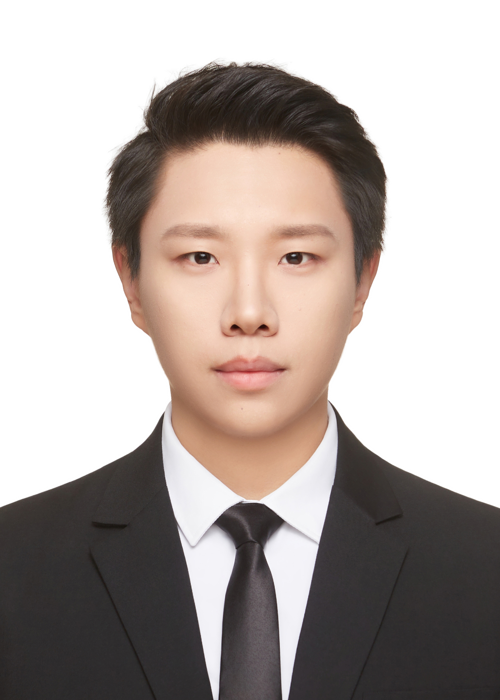

  

    
    

      
<strong>🎓 Dr. Candidate</strong>

      
Mechanical Engineering

      
China University of Mining and Technology

      

      
📧 <a href="mailto:haozhewang@cumt.edu.cn">haozhewang@cumt.edu.cn</a>

      
💻 <a href="https://github.com/klcss12138">github.com/klcss12138</a>

      

      
<strong>🔬 Research</strong> Robot Visual Perception Image Feature Matching Robot Visual Navigation

    

  

  

    <h1 style="margin-top: 0;">Hi there! 👋 I'm Haozhe Wang</h1>
    
Welcome to my GitHub homepage! I'm a Doctor's Candidate in Mechanical Engineering at China University of Mining and Technology (CUMT), passionate about advancing research in robot visual perception, image feature matching, and robot visual navigation.

    <h2>About Me</h2>
  <ul>
    <li>🎓 <strong>Current Status</strong>: Doctor's Candidate (2026 - Present) at CUMT, Xuzhou, China</li>
    <li>🔬 <strong>Research Focus</strong>: Robot visual perception, Image feature matching, Robot visual navigation</li>
  </ul>

  <h2>Education</h2>
  <table>
    <tr>
      <th>Degree</th>
      <th>Institution</th>
      <th>Major</th>
      <th>Year</th>
    </tr>
    <tr>
      <td>Doctor's</td>
      <td>China University of Mining and Technology</td>
      <td>Mechanical Engineering</td>
      <td>2026 - Present</td>
    </tr>
    <tr>
      <td>Master's</td>
      <td>China University of Mining and Technology</td>
      <td>Mechanical Engineering</td>
      <td>2024 - 2026</td>
    </tr>
    <tr>
      <td>Bachelor's</td>
      <td>China University of Mining and Technology</td>
      <td>Robot Engineering</td>
      <td>2020 - 2024</td>
    </tr>
  </table>

  <h2>Research Interests</h2>
  <ul>
    <li>Robot visual perception</li>
    <li>Image feature matching</li>
    <li>Robot visual navigation</li>
  </ul>

  <h2>Selected Honors and Awards</h2>
  <ul>
    <li>Principal Investigator, Postgraduate Research & Practice Innovation Program of Jiangsu Province (Completed, 2025)</li>
    <li>Second Prize (National Final), China International Sensor Innovation and Entrepreneurship Competition</li>
    <li>Second-Class Scholarship, China University of Mining and Technology, 2025</li>
    <li>Wang Yanqing Enterprise Scholarship, 2025</li>
    <li>First-Class Scholarship, China University of Mining and Technology, 2024</li>
  </ul>

  <h2>Skills</h2>
  <ul>
    <li><strong>Programming Languages</strong>: Python, C++</li>
    <li><strong>Deep Learning Frameworks</strong>: PyTorch, TensorFlow</li>
    <li><strong>Tools & Libraries</strong>: Open3D, NumPy, OpenCV, Git, Zotero</li>
    <li><strong>Academic Writing</strong>: LaTeX, Markdown</li>
  </ul>

